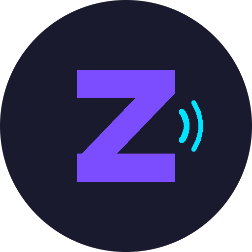

<p align="center">
  
</p>

<h1 align="center">Zonik Mobile</h1>

<p align="center">
  A native Android music player for <a href="https://github.com/Pr0zak/Zonik">Zonik</a> self-hosted music servers.<br>
  Streams your library over OpenSubsonic with Android Auto, Chromecast, and Google TV support.
</p>

## Features

### Playback
- **Streaming** with smart bitrate (Wi-Fi/cellular), adaptive degradation on slow connections
- **5-band equalizer** with 10 presets, custom band levels, and system EQ launch
- **Waveform seek bar** — static track waveform from server API, cached locally
- **Connection resilience** — automatic retry with exponential backoff, network reconnect recovery
- **Queue restore** — resumes last queue and position after app restart

### Multi-Device
- **Android Auto** — configurable browse tabs, star/delete buttons, voice search
- **Chromecast** — Google Cast SDK with styled media receiver
- **Google TV** — dedicated TV interface with D-pad navigation, visual screensaver
- **Wear OS** — remote control from Pixel Watch (Now Playing, browse, queue, tile)

### Google TV
- **Left sidebar navigation** (Home / Settings)
- **Shuffle Mix + Shuffle Favorites** — one-tap playback
- **Now Playing card** with ambient color glow from album art, playback controls, star, progress bar
- **Visual screensaver** (10s idle) — large album art with breathing animation, floating particles (orbs/rings/sparkles with blur trails), pulsing glow rings on bass, aurora color bands
- **Beat detection** via Visualizer API — glow rings and aurora react to bass + highs
- **Pairing code login** — type server URL, get 6-digit code, enter on server `/pair` page
- **Install via Downloader** — enter `zonik:3000/app`
- **Self-update** — Check Update downloads + installs APK directly

### Library & Offline
- **Library sync** via OpenSubsonic `search3` API with starred + flagged sync
- **Offline caching** — auto-cache queue and favorites, separate pinned storage (never evicted)
- **Mark for deletion** — synced with server, bulk delete from Flagged tab
- **8 Library tabs** — Tracks, Albums, Artists, Favorites, Genres, Playlists, Flagged, Offline

### UI
- **Premium dark theme** — glass morphism, gradient buttons, gold lossless badges, floating mini player
- **Now Playing** — album art glow, glass controls, Palette colors, queue with zebra-stripe, swipe-to-dismiss
- **Stats page** — format/bitrate/genre/decade distributions, most played, top artists
- **Editable server settings** — tap to edit URL, username, API key with test connection

### Other
- **Scrobbling** via Subsonic API
- **Self-update** from GitHub releases
- **Debug logging** with upload to server or private GitHub Gists

## Screenshots

*Coming soon*

## Requirements

- Android 8.0+ (API 26)
- A running [Zonik](https://github.com/Pr0zak/Zonik) server

## Install

### Phone

Download the latest `zonik-v*-debug.apk` from [Releases](https://github.com/Pr0zak/Zonik-mobile/releases) and sideload it.

For **Android Auto**: enable Developer Mode (tap version 10x in Android Auto settings), then enable "Unknown sources" in developer settings.

### Google TV

1. Install the **Downloader** app from Play Store
2. Open Downloader, enter: `zonik:3000/app`
3. Install the APK
4. Open Zonik → enter server URL → tap **"Pair with code"**
5. Go to `zonik:3000/pair` on your phone and enter the 6-digit code

### Wear OS (Pixel Watch)

The companion app runs on your watch and acts as a remote control for the phone app — no server connection needed on the watch.

1. Download `wear-debug.apk` from [Releases](https://github.com/Pr0zak/Zonik-mobile/releases)
2. Enable **Developer options** on the watch: Settings > System > About > tap **Build number** 7 times
3. Enable **ADB debugging**: Settings > Developer options > ADB debugging
4. Find the watch IP: Settings > Connectivity > Wi-Fi > connected network > tap to see IP
5. Connect to the watch over Wi-Fi:
   ```bash
   adb connect <watch-ip>:5555
   ```
6. Install the APK:
   ```bash
   adb -s <watch-ip>:5555 install wear-debug.apk
   ```
5. Open **Zonik** on the watch — it connects to the phone's playback service automatically

The watch app provides Now Playing controls (play/pause, skip, seek via crown, star), library browsing, queue management, a Now Playing tile, and a watch face complication.

## Build

```bash
export JAVA_HOME=$HOME/tools/jdk-17.0.12
export ANDROID_HOME=$HOME/tools/android-sdk
./gradlew assembleDebug
```

APK outputs:
- Phone: `app/build/outputs/apk/debug/app-debug.apk`
- Wear: `wear/build/outputs/apk/debug/wear-debug.apk`

## Tech Stack

- Kotlin, Jetpack Compose, Material 3 (custom dark theme with glass morphism)
- AndroidX Media3 (ExoPlayer) + MediaLibraryService
- SimpleCache + CacheDataSource for audio caching
- Retrofit + OkHttp + Kotlinx Serialization
- Room + Paging 3
- Hilt (DI), Coil (images), WorkManager
- Google Cast SDK + AndroidX MediaRouter

## License

Private — for personal use only.
